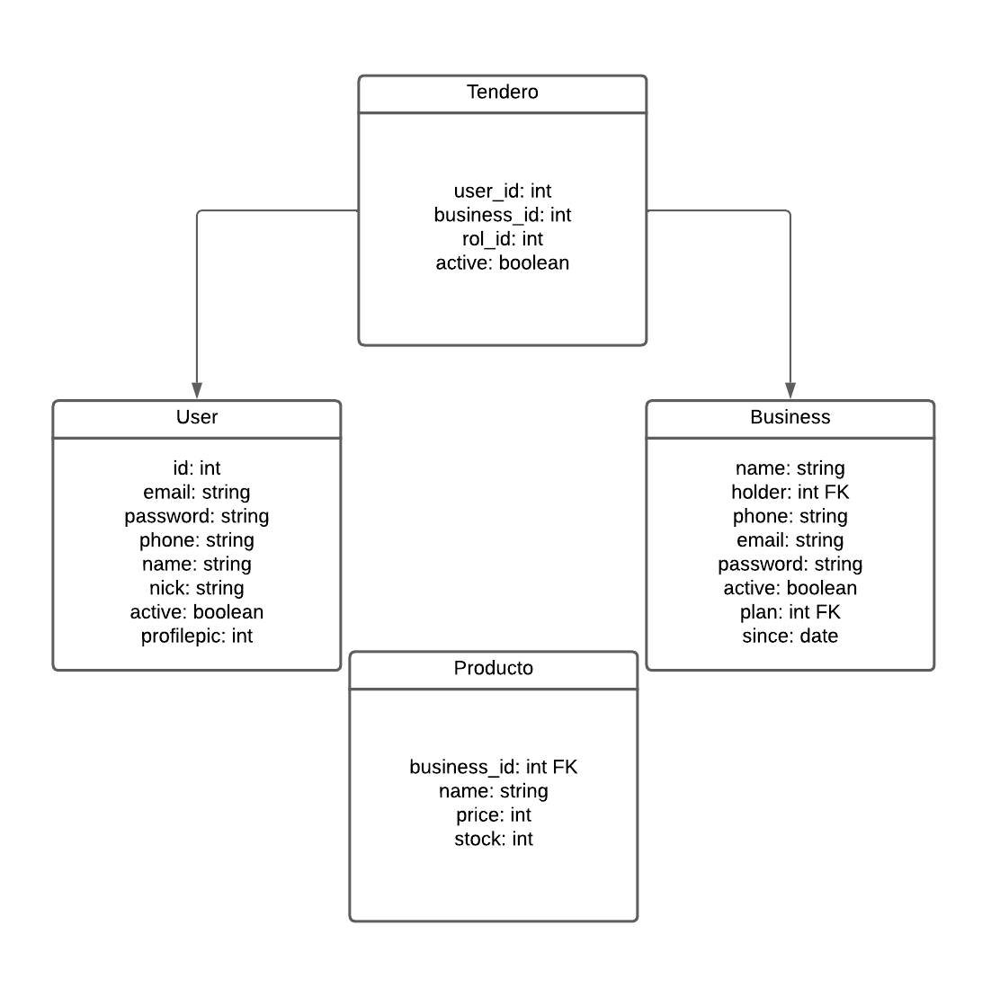

# 📋Market Analysis Tool: Paso a paso.

## ⚙️Lógica interna.
- [x] 🧠Planear entidades y fuentes de datos.

- [ ] 💻Codificar las entidades y sus relaciones (Modelos, Servicios y Rutas).
    - [ ] Fase 1:
        - [x] User.
            - [x] Get all.
            - [x] Get one.
            - [x] Create.
            - [x] Update.
            - [x] Delete.
            - [x] Login.
        - [x] Business.
            - [x] Get all.
            - [x] Get one. 
            - [x] Create.
            - [x] Update.
            - [x] Delete.
            - [x] Login.
        - [x] Product.
            - [x] Get all.
            - [x] Get one.
            - [x] Create.
            - [x] Update.
            - [x] Delete.
        - [ ] Shopkeeper.
            - [ ] Get all.
            - [ ] Get one.
            - [ ] Create.
            - [ ] Update.
            - [ ] Delete.
        

    - [ ] Fase 2:
        - [ ] Purchase.
            - [ ] Get all.
            - [ ] Get one.
            - [ ] Create.
            - [ ] Update.
            - [ ] Delete.
        - [ ] Order.
            - [ ] Get all.
            - [ ] Get one.
            - [ ] Create.
            - [ ] Update.
            - [ ] Delete.
    - [ ] Fase 3:
        - [ ] Rol.
            - [ ] Get all.
            - [ ] Get one.
            - [ ] Create.
            - [ ] Update.
            - [ ] Delete.
        - [ ] Tags.
            - [ ] Get all.
            - [ ] Get one.
            - [ ] Create.
            - [ ] Update.
            - [ ] Delete.
        - [ ] Imagen.
            - [ ] Get all.
            - [ ] Get one.
            - [ ] Create.
            - [ ] Update.
            - [ ] Delete.
        - [ ] Comment.
            - [ ] Get all.
            - [ ] Get one.
            - [ ] Create.
            - [ ] Update.
            - [ ] Delete.
- [ ] Planeación de rutas y controladores.
