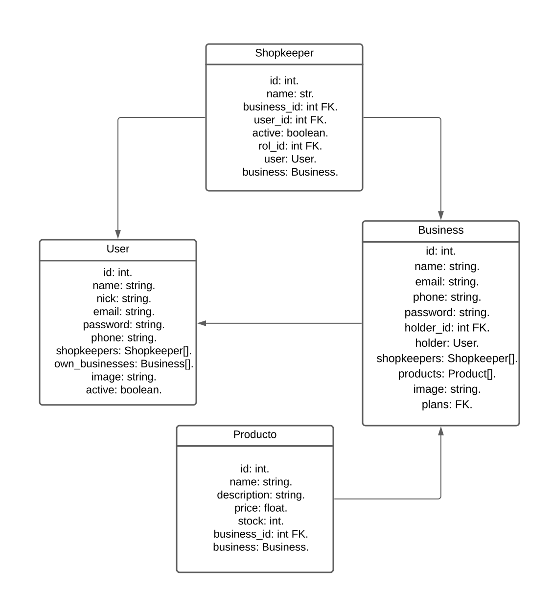

# 📋Market Analysis Tool: Paso a paso.

## ⚙️Preset.
<li>
    - [ ] 🧠Planear entidades y fuentes de datos.
</li>

<li>
    - [ ] 💻Codificar las entidades y sus relaciones (Modelos, Servicios y Rutas).
</li>
        <table width="500" align="center">
        <tr>
            <th>Usuario</th>
            <th>Negocio</th>
        </tr>
        <tr>
            <td>
                <ol>
                    <li>
                         - [x] Get all
                    </li>
                    <li>
                         - [x] Get one
                    </li>
                    <li>
                         - [x] Create
                    </li>
                    <li>
                         - [x] Auth
                    </li>
                    <li>
                         - [x] Delete
                    </li>
                    <li>
                         - [x] Update
                    </li>
                </ol>
            </td>
            <td>
                <ol>
                    <li>
                         - [x] Get all
                    </li>
                    <li>
                         - [x] Get one
                    </li>
                    <li>
                         - [x] Create
                    </li>
                    <li>
                         - [x] Auth
                    </li>
                    <li>
                         - [x] Update
                    </li>
                    <li>
                         - [x] Delete
                    </li>
                </ol>
            </td>
        </tr>
        <tr>
            <th>Comerciante</th>
            <th>Producto</th>
        </tr>
        <tr>
            <td>
                <ol>
                    <li>
                        - [x] Get all
                    </li>
                    <li>
                        - [x] Get one
                    </li>
                    <li>
                        - [x] Create
                    </li>
                    <li>
                        - [x] Update
                    </li>
                    <li>
                        - [x] Delete
                    </li>
                </ol>
            </td>
            <td>
                <ol>
                    <li>
                        - [x] Get all
                    </li>
                    <li>
                        - [x] Get one
                    </li>
                    <li>
                        - [x] Create
                    </li>
                    <li>
                        - [x] Update
                    </li>
                    <li>
                        - [x] Delete
                    </li>
                </ol>
            </td>
        </tr>
    </table>

    

        <table width="500" align="center">
        <tr>
            <th>Purchase</th>
            <th>Order</th>
        </tr>
        <tr>
            <td>
                <ol>
                    <li>
                        <input type="checkbox">
                        <label>Get all</label>
                    </li>
                    <li>
                        <input type="checkbox">
                        <label>Get one</label>
                    </li>
                    <li>
                        <input type="checkbox">
                        <label>Create</label>
                    </li>
                    <li>
                        <input type="checkbox">
                        <label>Update</label>
                    </li>
                    <li>
                        <input type="checkbox">
                        <label>Delete</label>
                    </li>
                </ol>
            </td>
            <td>
                <ol>
                    <li>
                        <input type="checkbox">
                        <label>Get all</label>
                    </li>
                    <li>
                        <input type="checkbox">
                        <label>Get one</label>
                    </li>
                    <li>
                        <input type="checkbox">
                        <label>Create</label>
                    </li>
                    <li>
                        <input type="checkbox">
                        <label>Update</label>
                    </li>
                    <li>
                        <input type="checkbox">
                        <label>Delete</label>
                    </li>
                </ol>
            </td>
        </tr>
    </table>

    <table width="500" align="center">
        <tr>
            <th>Tag</th>
            <th>Rol</th>
        </tr>
        <tr>
            <td>
                <ol>
                    <li>
                        <input type="checkbox">
                        <label>Get all</label>
                    </li>
                    <li>
                        <input type="checkbox">
                        <label>Get one</label>
                    </li>
                    <li>
                        <input type="checkbox">
                        <label>Create</label>
                    </li>
                    <li>
                        <input type="checkbox">
                        <label>Update</label>
                    </li>
                    <li>
                        <input type="checkbox">
                        <label>Delete</label>
                    </li>
                </ol>
            </td>
            <td>
                <ol>
                    <li>
                        <input type="checkbox">
                        <label>Get all</label>
                    </li>
                    <li>
                        <input type="checkbox">
                        <label>Get one</label>
                    </li>
                    <li>
                        <input type="checkbox">
                        <label>Create</label>
                    </li>
                    <li>
                        <input type="checkbox">
                        <label>Update</label>
                    </li>
                    <li>
                        <input type="checkbox">
                        <label>Delete</label>
                    </li>
                </ol>
            </td>
        </tr>
        <tr>
            <th>Comment</th>
        </tr>
        <tr>
            <td>
                <ol>
                    <li>
                        <input type="checkbox">
                        <label>Get all</label>
                    </li>
                    <li>
                        <input type="checkbox">
                        <label>Get one</label>
                    </li>
                    <li>
                        <input type="checkbox">
                        <label>Create</label>
                    </li>
                    <li>
                        <input type="checkbox">
                        <label>Update</label>
                    </li>
                    <li>
                        <input type="checkbox">
                        <label>Delete</label>
                    </li>
                </ol>
            </td>
        </tr>
    </table>
